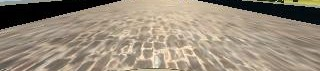

# **Behavioral Cloning** 

**Behavioral Cloning Project**

The goals / steps of this project are the following:
* Use the simulator to collect data of good driving behavior
* Build, a convolution neural network in Keras that predicts steering angles from images
* Train and validate the model with a training and validation set
* Test that the model successfully drives around track one without leaving the road
* Summarize the results with a written report

### Files Submitted & Code Quality

#### 1. Submission includes all required files and can be used to run the simulator in autonomous mode

My project includes the following files:
* model.py containing the script to create and train the model
* drive.py for driving the car in autonomous mode
* model.h5 containing a trained convolution neural network 
* writeup_report.md or writeup_report.pdf summarizing the results

#### 2. Submission includes functional code
Using the Udacity provided simulator and my drive.py file, the car can be driven autonomously around the track by executing 
```sh
python drive.py model.h5
```

#### 3. Submission code is usable and readable

The model.py file contains the code for training and saving the convolution neural network. The file shows the pipeline I used for training and validating the model, and it contains comments to explain how the code works.

### Model Architecture and Training Strategy

#### 1. An appropriate model architecture has been employed
At first, i crop the images with a Keras Cropping2D layer(model.py line 46).
First,i use a Keras lambda layer to normalize the data(model.py line 47).
Next,the model consists of 5 convolution neural networks(model.py lines 50-54),they are:
* CNN layer1:filter sizes(5x5), stride(2x2), activation(relu), depth(24) 
* CNN layer2:filter sizes(5x5), stride(2x2), activation(relu), depth(36) 
* CNN layer3:filter sizes(5x5), stride(2x2), activation(relu), depth(48)
* CNN layer4:filter sizes(3x3), activation(relu), depth(64) 
* CNN layer5:filter sizes(3x3), activation(relu), depth(64)

Third,the model has a flatten layer and four fully connected layers.

#### 2. Attempts to reduce overfitting in the model

The model was trained and validated on different data sets to ensure that the model was not overfitting (code line 67 ). The model was tested by running it through the simulator and ensuring that the vehicle could stay on the track,and i try different values of the epoch parameter to avoid overfitting.(model.py line 67).
Besides, the model also used a dropout layer to avoid overfitting(model.py line 57).

#### 3. Model parameter tuning

The model used an adam optimizer, so the learning rate was not tuned manually (model.py lines 66), and to get better model i use the right images and left images from multiple cameras,also with a correction parameter which can be turned.

#### 4. Appropriate training data

Training data was chosen to keep the vehicle driving on the road. I used the udacity's data(data.zip),besides i also pick some more training data and add them to the udacity's data. Because when i only use udacity's data, i find the car cannot run well in one of the three sharp corners and on the bridge. so i collect some data when the car in the corner and on the bridge, and i also make the car run counter-clockwise, pick one more round data.

I also used a combination of center lane driving, recovering from the left and right sides of the road.

I also used a multiple cameras data.


### Architecture and Training Documentation 

#### 1. Solution Design Approach

The overall strategy for deriving a model architecture was to train the car can drive autonomous itslef without tire leaving the drivable portion of the track surface.

My first step was to use a convolution neural network model similar to the NVIDA model which has a good performance on their autonomous car, I thought this model might be appropriate CNN layers which can extract enough features.

In order to gauge how well the model was working, I split my image and steering angle data into a training and validation set. I found that my first model had a low mean squared error on the training set but a high mean squared error on the validation set. This implied that the model was overfitting. 

To combat the overfitting, I modified the model so that it avoid overfitting.

Then I add a dropout layer which can help avoid overfitting.

The final step was to run the simulator to see how well the car was driving around track one. There were a few spots where the vehicle fell off the track, to improve the driving behavior in these cases, I collect two more round data.

At the end of the process, the vehicle is able to drive autonomously around the track without leaving the road.

#### 2. Final Model Architecture

The final model architecture consisted of 5 convolution neural networks with the following layers and layer sizes.
* CNN layer1:filter sizes(5x5), stride(2x2), activation(relu), depth(24) 
* CNN layer2:filter sizes(5x5), stride(2x2), activation(relu), depth(36) 
* CNN layer3:filter sizes(5x5), stride(2x2), activation(relu), depth(48)
* CNN layer4:filter sizes(3x3), activation(relu), depth(64) 
* CNN layer5:filter sizes(3x3), activation(relu), depth(64)

#### 3. Creation of the Training Set & Training Process

To capture good driving behavior, I first used the udacity data.zip images, then i found the model performs not so well 
in one sharp turn and when off the bridge. so i collect two more round data, one round clockwise and one round counter-clockwise.

I then crop the picturs from shape（160,320） to (85,320).
They looks like below :


 


After the collection process, I had 14060 number of data points. I then preprocessed this data by cropping and turn the BGR format to RGB format.

I finally randomly shuffled the data set and put 20% of the data into a validation set. 

I used this training data for training the model. The validation set helped determine if the model was over or under fitting. The ideal number of epochs was 3 as evidenced by train loss and validation loss, I used an adam optimizer so that manually training the learning rate wasn't necessary.
